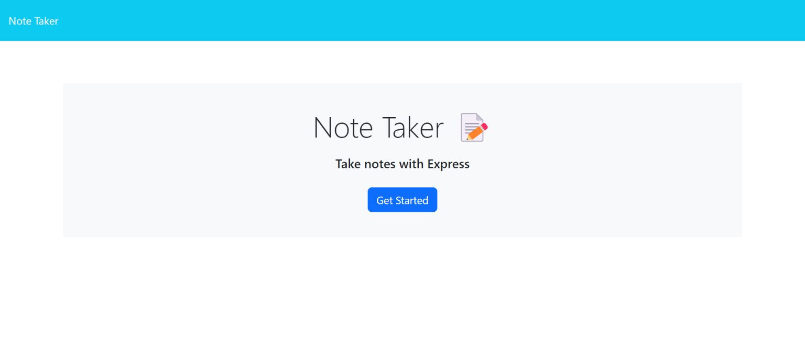
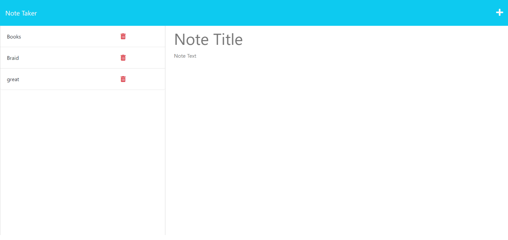

# Note-Taker

## Description
An application that is used to write, save and delete notes.

## Table of Contents

* [Installation](#installation)
* [Usage](#usage)
* [URLs](#urls)
* [License](#license)
* [Questions](#questions)

## Installation

Fork, download or clone the repository from Github. The application also requires the file system, router, path, express and util modules.

## Usage

Run "node server.js" to start then navigate to a browser window to localhost:3001 or use the live application via the Heroku link provided above                             

## URLs

The deployed application can be found [here](https://shielded-wildwood-89923.herokuapp.com/) .

The URL of the GitHub repository containing the code is: https://github.com/Buky-js/Note-Taker

## License

This project is licensed under the MIT License.

## Questions
If you have any questions about this project, please contact me directly at bukyabiona@gmail.com.